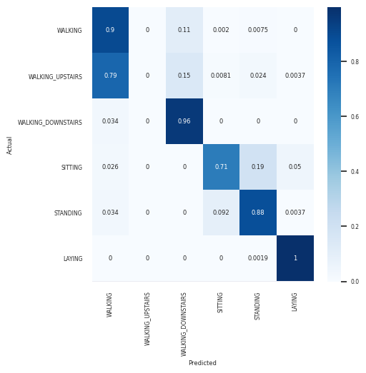
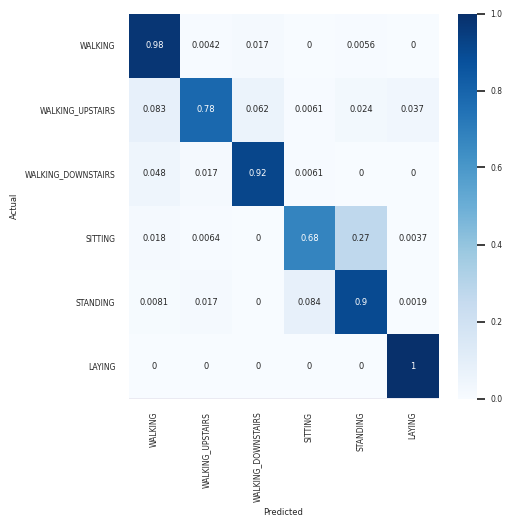
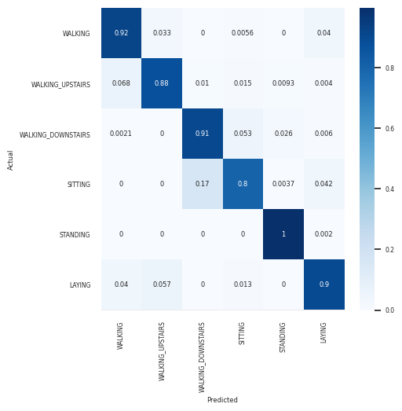

## MobileNet

### Running training and evaluation of the model

Set environment variable `HAR_PIPELINE_PATH` to the root of your copy of https://github.com/davors/HAR-pipline.

You can set up the Pipenv environment to run `mobilenet_uci-har.py` with the provided `Pipfile`.

Run the model with the following command. Select whether you want to train the network. Pass a path to the file where you want the PyTorch checkpoint to be created after training. This value is also used when evaluating an trained model.

```
python mobilenet_uci-har.py train|test path_to_pytorch_checkpoint.pth
```

### Acknowledgment

The neural networks descriptions found in python scripts were taken from the [ApproxHPVM](https://gitlab.engr.illinois.edu/llvm/hpvm-release). [Direct link to the directory where you can find them](https://gitlab.engr.illinois.edu/llvm/hpvm-release/-/tree/main/hpvm/test/dnn_benchmarks/pytorch/dnn).

### About

Data used was from UCI-HAR dataset. Data from Inertial-Signals were used. This data is filtered using median filter. Accelerometer data is split into 2 components: gravitation and body accelerations, using a low/high pass filter with frequency 0.3Hz. Segment vectors are 128 samples long, sampling rate was 50Hz.

Each `channel` (body_acc, body_gyro, total_acc) is put into a 32x32 single channel image like shown below, resulting in 3x32x32 signal images.

```
[
    8 rows for d in [x, y, z, y, x, z, x, y]:
        channel.d[0..32]
    8 rows for d in [x, y, z, y, x, z, x, y]:
        channel.d[32..64]
    8 rows for d in [x, y, z, y, x, z, x, y]:
        channel.d[64..96]
    8 rows for d in [x, y, z, y, x, z, x, y]:
        channel.d[96..128]
]
```

| epochs | learning rate | accuracy | file                       |                                          |
| -----: | ------------: | -------: | -------------------------- | ---------------------------------------- |
|      2 |          0.10 |      74% | mobilenet_uci-har_0.74.pth |                                          |
|      5 |          0.40 |      87% | mobilenet_uci-har_0.87.pth |                                          |
|     11 |   0.80-0.20\* |      87% | mobilenet_uci-har_0.90.pth | \*Learning rate is halved every 5 epochs |

<div class="page"/>

### mobilenet_uci-har_0.74.pth



<div class="page"/>

### mobilenet_uci-har_0.87.pth



### mobilenet_uci-har_0.87.pth


